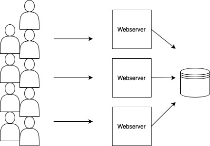

# Introduction and MapReduce

A **distributed system** is a collection of computers working cooperatively to
complete a certain task.

Reasons people use distributed systems:

- Parallelism
- Fault tolerance and redundancy
- Geospatial or physical separation
- Security, separation and isolation of resources

Challenges confronted in distributed system design:

- Single node systems are either working or failing; they have definite failure
  patterns. Distributed systems have unusual failure patterns where they can be
  in a partial state of functionality, either due to some nodes failing or network
  partitioning ... _etc_.
- Concurrency and clock synchrnoization.
- Often distributed systems are designed with aim of maximizing performance, but
  this can be tricky due to overhead, network communication _etc_.

A distributed system generally serves as infrastructure in support of some
application. There are broadly three types of infrastructure:

- Storage (biggest emphasis in this course)
- Communications (not emphasis of this course)
- Compute, _e.g._ MapReduce

One of our main goals in the course is to discover abstractions that simplify
the interface to these compute and storage infrastructures, to make it easy
to build applications on top of them. These abstractions would serve to hide
the distributed nature of these systems. For example, a file-system abstraction
over a distributed storage system that looks just like the single-node filesystem,
_e.g._ Hadoop.

What implementation techniques will be encountered?

- Remote Procedure Calls (RPCs), whose goal is to represent an operation in a
  distributed system, which is carried out over an unreliable network, as a local
  function call.
- Threads and the ensuing concurrency control, _e.g._ locks, to structure concurrent
  logic and organize it from a programmer's point of view.

## Big ideas in course

- **Performance and scalability**: By scalability we mean linear speedup according to some
  metric, like latency or throughput. This means if we double our computational resource
  we double our performance, according to that metric. This is also known as horizontal
  scaling. This is the dream, since you can just throw more money at the problem to get
  more commodity-grade hardware.

  In the example shown below, more webservers can be added, which will increase the
  performance up to a certain point: They are all talking to the same database, and
  this database will become the bottleneck.

  

- **Fault tolerance**: A single node can stay up for years without crashing, however, with
  a distributed system of about a thousand nodes, even if each one crashes only about once
  a year, you would have around 3 nodes crashing a _day_. Additionally, there is a lot of
  networking, so network cables and switches, and someone may just trip on a cable, or a
  switch had its fan broken and overheats. Rare crashes become the norm, rather than the
  exception. The main goal is masking these failures from application programmers.
  There are multiple facets to fault tolerance:

  - **Availability**: Promise to continue serving in the face of certain, but not all failures.
  - **Recoverability**: In the case of failure, the system promises to resume operation as if
    nothing had happened, with the same state prior to the crash. This can be achieved by
    writing the trajectory of the state of the system to non-volatile storage like HDDs,
    SSDs _etc_. Another way is to replicate the state of the system unto multiple nodes.

- **Consistency**:
  Once there are multiple copies of your data on multiple machines, ensuring that a client
  gets the latest version of a piece of data can be quite costly, and can be in conflict
  with availability in the case of a network failure. Additionally, having the nodes in the
  cluster talk to each other to decide what the latest version of a piece of data is can be
  costly as it takes time of the order of a tens of milliseconds. Thus, many systems relax
  this assumption of _strong_ consistency.

## MapReduce

Google built the MapReduce system when faced with issues like:

- building an inverted index of the web
- analyze the graph / hyperlink structure of the web
  for determining the most relevant web search results.

The idea is that Google didn't want to just hire distributed systems engineers. They wanted
to enable all kinds of other engineers and application developers to write and run their
large-scale jobs on distributed systems. The MapReduce abstraction enables that: the engineers
would just write two functions: A Map function, and a Reduce function, neither of which know
anything about distributed systems. The MapReduce framework would take care of everything else.

### Highlights of the MapReduce discussion

- There are two types of processes: Master and worker. The master periodically checks to see
  if workers are still alive, sends the user-defined map and reduce functions to workers, handles
  worker failures, assigns file chunks for workers to handle and so on.
- There are two types of workers: Map workers and reduce workers. The user input, generically
  a large dataset, is broken up into chunks 64 MBs in size, and each chunk is sent to a Map worker,
  so for a file 1 TB in size, there would be approximately 16,000 map workers.
- The bottleneck described in the Google MapReduce paper is network throughput. An optimization
  they thus made is to put the Google File-System (GFS) and the MapReduce framework on the same
  set of servers. This is great because any data already on the GFS would be broken up into 64 MB
  chunks, and the master process would ensure that the Map worker processing that chunk already
  has it _locally_, so it wouldn't need to make a remote call to fetch that data from another server.
- When a map worker finishes, it writes to its _local_ filesystem a file with key-value pairs,
  extracted from the chunk it processed.
- Once all the map workers are done, the reduce workers fetch the data from the map servers via
  remote procedure calls (RPCs). This involves many network calls, as the values for a given key
  could be spread out all over the GFS. These files are sorted in order to group all the values
  for a given key together, then the user-defined reduce function is invoked _at least once_ per
  key. There are as many output files produced as there are reduce workers.
- The map and reduce functions are pure, mathematical functions that _only_ act on their
  inputs to produce outputs. They don't produce any side-effects. This ensures safe retries
  in case of failure (idempotence), because they most likely will be run more than once.
- MapReduce is very imperative, in the sense if you have a complex task you would run
  more than once MapReduce job in a pipeline, but each step is done in isolation. A more
  declarative approach would have a holistic view of the entire processing pipeline, and
  carry out an optimal plan of how to execute it. It isn't uncommon to compose many MapReduce
  jobs, one after the other.
- MapReduce is batch-based: The mappers have to be done before the reducers can start.
  Additionally, there has to be a notion of finite data. There are more modern streaming systems
  like Spark that address this.

## Readings:

- [Google MapReduce paper](../readings/mapreduce.pdf)
